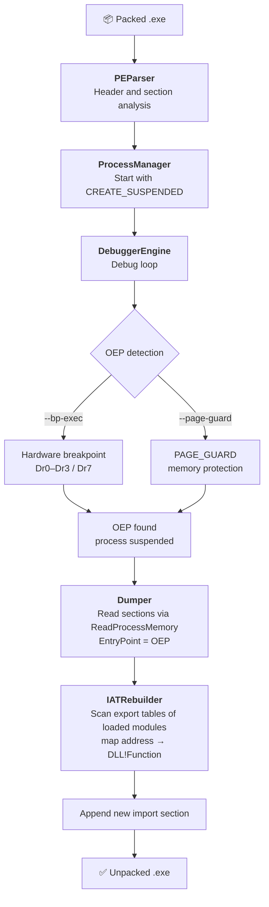

# PE Unpacker

**English** | [Türkçe](README.tr.md)

An unpacker for packed Windows PE executables, built on the Win32 Debug API. It runs
the target program under a debugger, catches the original entry point (OEP), dumps
the process memory and rebuilds the import table. Developed as part of an
object-oriented programming course.

## Pipeline



| Module | Responsibility |
|---|---|
| `PEParser` | Static analysis of the input file (headers, sections) |
| `ProcessManager` | Starts and manages the target process with `CREATE_SUSPENDED` |
| `DebuggerEngine` | Debug loop; OEP detection via hardware breakpoints or PAGE_GUARD |
| `Dumper` | Reads sections from memory and updates the PE header |
| `IATRebuilder` | Rebuilds the Import Address Table in a new section |
| `MainWindow` | Native Win32 graphical interface |

The abstract `IUnpacker` interface allows different OEP-finding strategies to be
plugged in (Strategy pattern).

## Building

Requires Windows, Visual Studio (MSVC) and CMake 3.20+.

```bash
cmake -B build
cmake --build build --config Release
```

Two executables are produced: `unpacker.exe` (console) and `unpacker_gui.exe` (GUI).

## Usage

```
unpacker.exe <input.exe> <output.exe>
             [--bp-exec <VA>]              hardware execute breakpoint for the OEP
             [--page-guard <VA> <size>]    PAGE_GUARD watch region for the OEP
             [--iat <VA> <size>]           region for IAT reconstruction
```

## Documentation

Project report in IEEE format: [English](docs/Report_EN.pdf) · [Türkçe](docs/Rapor_TR.pdf)

> This tool was developed for educational and reverse-engineering research purposes.
