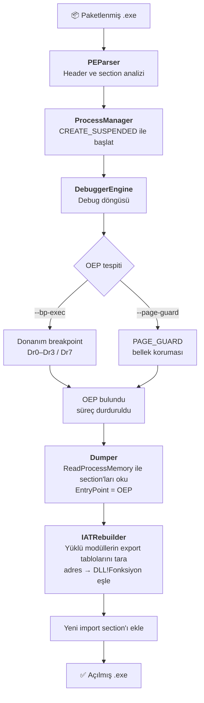

# PE Unpacker

[English](README.md) | **Türkçe**

Paketlenmiş (packed) Windows PE çalıştırılabilir dosyalarını açmak için yazılmış,
Win32 Debug API tabanlı bir unpacker. Hedef programı debugger altında çalıştırır,
orijinal giriş noktasını (OEP) yakalar, bellekten dump alır ve import tablosunu
yeniden oluşturur. Nesne yönelimli programlama dersi kapsamında geliştirilmiştir.

## İşlem Hattı



| Modül | Görev |
|---|---|
| `PEParser` | Girdi dosyasının statik analizi (header'lar, section'lar) |
| `ProcessManager` | Hedef süreci `CREATE_SUSPENDED` ile başlatma ve yönetme |
| `DebuggerEngine` | Debug döngüsü; donanım breakpoint'i veya PAGE_GUARD ile OEP tespiti |
| `Dumper` | Section'ları bellekten okuma, PE header'ını güncelleme |
| `IATRebuilder` | Import Address Table'ı yeni bir section'da yeniden inşa etme |
| `MainWindow` | Native Win32 grafik arayüz |

`IUnpacker` soyut arayüzü sayesinde farklı OEP bulma stratejileri eklenebilir
(Strategy pattern).

## Derleme

Windows + Visual Studio (MSVC) ve CMake 3.20+ gerekir.

```bash
cmake -B build
cmake --build build --config Release
```

İki çıktı üretilir: `unpacker.exe` (konsol) ve `unpacker_gui.exe` (grafik arayüz).

## Kullanım

```
unpacker.exe <input.exe> <output.exe>
             [--bp-exec <VA>]              OEP için donanım execute breakpoint'i
             [--page-guard <VA> <size>]    OEP için PAGE_GUARD izleme bölgesi
             [--iat <VA> <size>]           IAT yeniden inşa bölgesi
```

## Dokümantasyon

IEEE formatında proje raporu: [Türkçe](docs/Rapor_TR.pdf) · [English](docs/Report_EN.pdf)

> Bu araç eğitim ve tersine mühendislik çalışmaları amacıyla geliştirilmiştir.
